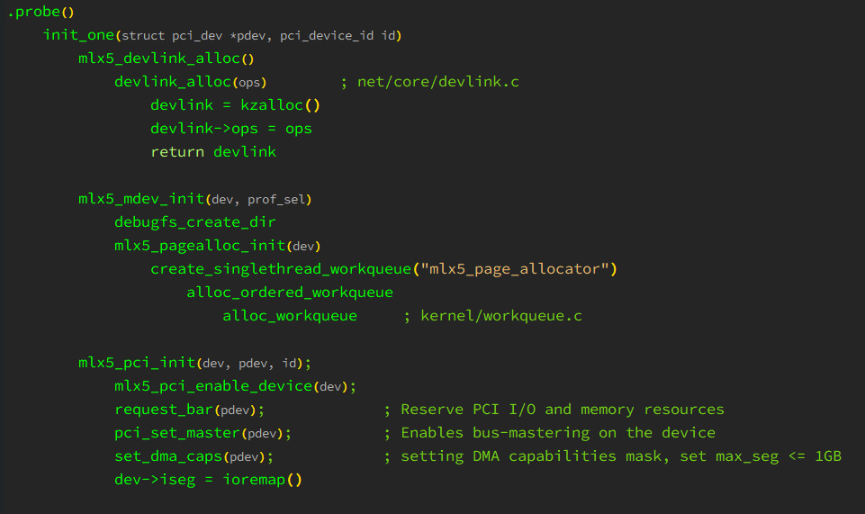

# flowgraph-mode

An Emacs major mode for editing flowgraph.


## Installation

Clone this repository, then add to your load-path then require:

``` emacs-lisp
(add-to-list 'load-path "~/.emacs.d/site-lisp/flowgraph-mode/")
(require 'flowgraph-mode)

;; alternative
(use-package flowgraph-mode
  :load-path "c:/Users/incubator/Projects/flowgraph-mode"
  :ensure nil)

```

## Usage

example:


